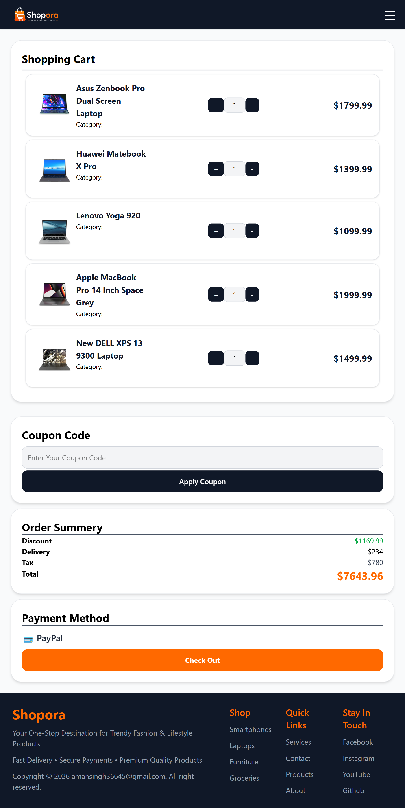
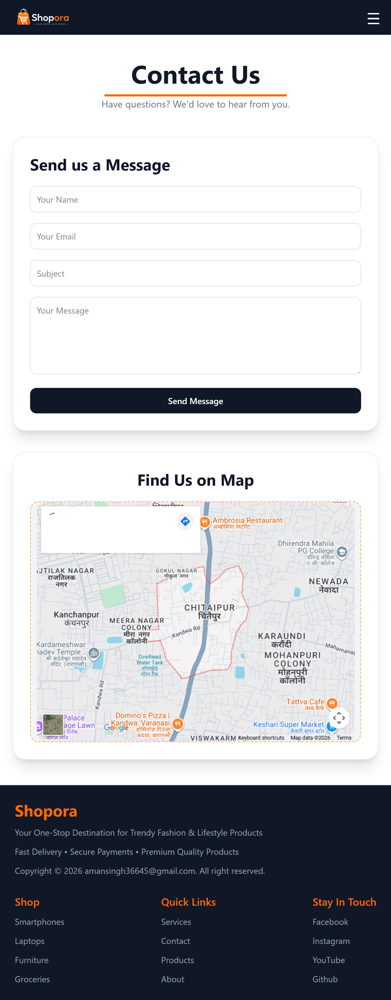

# 🛍️ Shopora

<p align="center">
  
</p>

<h3 align="center">
Modern • Responsive • React E-Commerce Website
</h3>

<p align="center">
A fully responsive e-commerce application built using React, Vite, Tailwind CSS, Context API, and DummyJSON API.
</p>

---

## 🌐 Live Demo

🚀 (https://shopora-e-commerce-nine.vercel.app/)

---

# 📖 About Shopora

Shopora is a modern e-commerce web application designed to deliver a smooth and responsive online shopping experience.

Users can browse products, filter by categories, add products to their cart, apply coupon codes, and view an order summary with automatic tax and delivery calculations.

The primary goal of this project was to strengthen my React development skills by building a real-world application using modern frontend technologies and best practices.

---

# ✨ Features

- 🛒 Add products to cart
- 🛍️ Dynamic shopping cart
- 🏷️ Category filtering
- 🎟️ Coupon code support
- 💰 Automatic tax calculation
- 🚚 Delivery charge calculation
- 📊 Order summary
- 📱 Fully responsive design
- ⚡ Fast loading using Vite
- 🎨 Modern UI with Tailwind CSS
- 📄 About page
- 📞 Contact page
- ⭐ Customer reviews
- 📦 Product listing using DummyJSON API

---

# 📸 Screenshots

## 🏠 Home Page


---

## 🛍️ Products Page


---

## 🛒 Shopping Cart




---

## 👨 About Page


---

## 📞 Contact Page




---

# 🛠️ Tech Stack

| Technology | Usage |
|------------|-------|
| React.js | Frontend Library |
| Vite | Build Tool |
| Tailwind CSS | Styling |
| React Router DOM | Routing |
| Context API | Global State Management |
| Axios | API Requests |
| DummyJSON API | Product Data |

---

# 📂 Folder Structure

```text
src
│
├── assets
│
├── components
│   ├── Navbar
│   ├── Footer
│   ├── ProductCard
│   └── CartItem
│
├── context
│
├── pages
│   ├── Home
│   ├── About
│   ├── ProductDetails
│   └── Contact
│
├── App.jsx
├── main.jsx
└── index.css
```

---

# 🚀 Installation

Clone the repository

```bash
git clone https://github.com/YOUR_USERNAME/shopora.git
```

Move into the project folder

```bash
cd shopora
```

Install dependencies

```bash
npm install
```

Start the development server

```bash
npm run dev
```

---

# 📦 Production Build

Create a production build

```bash
npm run build
```

Preview production build

```bash
npm run preview
```

---

# 🎯 Future Improvements

- ❤️ Wishlist
- 🔐 User Authentication
- 💳 Online Payment Integration
- 📦 Order History
- ❤️ Favorite Products
- ⭐ Product Ratings
- 🔍 Advanced Search
- 📱 Progressive Web App (PWA)
- 🌙 Dark Mode
- 📈 Admin Dashboard

---

# 📚 What I Learned

During this project I gained hands-on experience with:

- React Hooks
- Context API
- State Management
- React Router
- Axios API Integration
- Tailwind CSS
- Responsive Web Design
- Component-based Architecture
- Conditional Rendering
- Array Methods (map, filter)
- Git & GitHub

---

# 👨‍💻 Developer

### Aman Singh

Frontend Developer passionate about building responsive and user-friendly web applications using modern JavaScript technologies.

---

# 🙌 Acknowledgements

- DummyJSON API
- React Documentation
- Tailwind CSS Documentation
- Vite Documentation

---

# ⭐ Support

If you found this project helpful or interesting, please consider giving it a ⭐ on GitHub.

It motivates me to build more open-source projects.

---

<p align="center">
Made with ❤️ using React & Tailwind CSS
</p>
